<div align="center">

# Cloud Empire AI

**Infrastructure Operations Control Center**

Monitor services, review incidents, inspect logs, track activity, and run safe deployment workflows from one dark, operations-focused dashboard.

<a href="https://project-code-review.vercel.app/"></a>


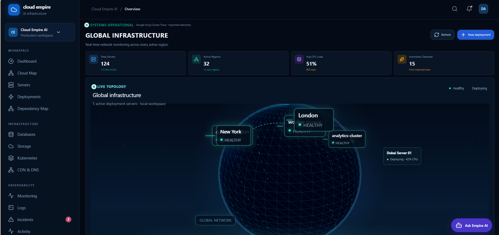

</div>

---

## Table of Contents

- [Overview](#overview)
- [Screenshots](#screenshots)
- [Features](#features)
- [How It Works](#how-it-works)
- [Tech Stack](#tech-stack)
- [Project Structure](#project-structure)
- [Design System](#design-system)
- [Getting Started](#getting-started)
- [Deployment](#deployment)
- [Security](#security)
- [Testing and Quality](#testing-and-quality)
- [Roadmap](#roadmap)
- [Notes for AI Coding Agents](#notes-for-ai-coding-agents)
- [License](#license)
- [Author](#author)

## Overview

Cloud Empire AI makes infrastructure work easier to understand and safer to operate. It combines a navigable control center with a live 3D global topology, observability views, deployment workflows, usage telemetry, incident review, activity history, reports, templates, maintenance controls, an in-app AI assistant, and authentication.

**Live demo:** [https://project-code-review.vercel.app/](https://project-code-review.vercel.app/). Create a free account with an email and password to explore the dashboard. No payment details are ever requested.

> **Local Safe Mode:** every change stays inside the project and no external infrastructure is provisioned. The current release is a polished, free MVP / demo foundation. Real cloud integrations and production-grade backup infrastructure are deliberate extension points.

**Goals**

- Give operators one clear place to understand infrastructure state.
- Make monitoring, logs, incidents, activity, and deployments easy to discover.
- Provide a free workspace with no payment or billing collection.
- Protect authenticated areas with Better Auth and server-side authorization patterns.
- Offer a foundation that can later connect to real cloud providers.

## Screenshots

### Dashboard

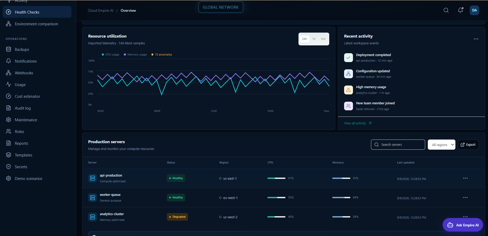

*Overview: resource utilization from imported telemetry, recent workspace activity, and production servers.*

### Servers and Deployments

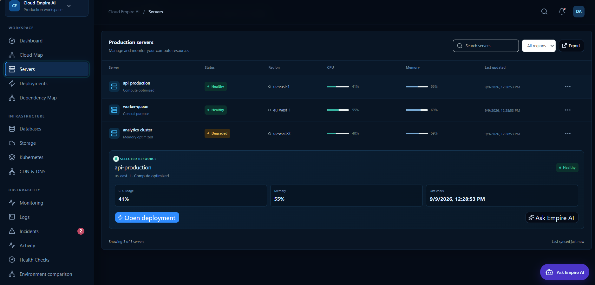

*Servers: live status, region, CPU and memory bars, plus a detail panel for the selected resource.*

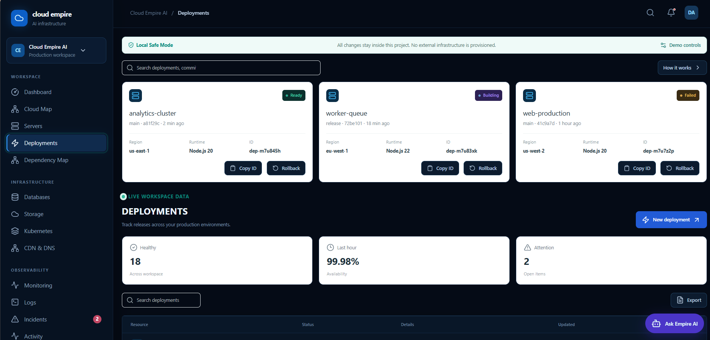

*Deployments: release cards with status, runtime, region, deployment ID, copy and rollback actions.*

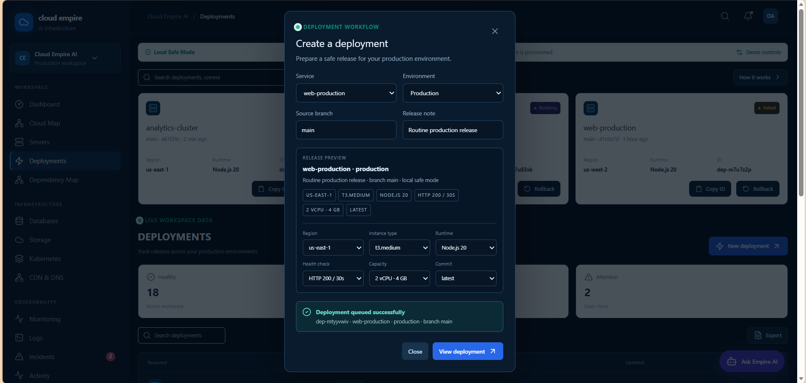

*Deployment workflow: choose service, environment, branch, region, instance type, runtime, and health check, preview the release, then queue it safely.*

### Observability

<table>
  <tr>
    <td width="50%">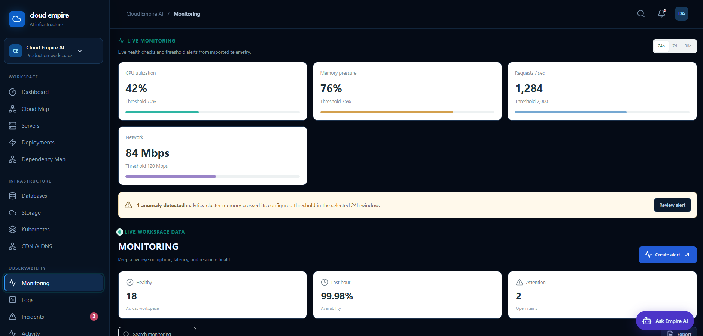</td>
    <td width="50%">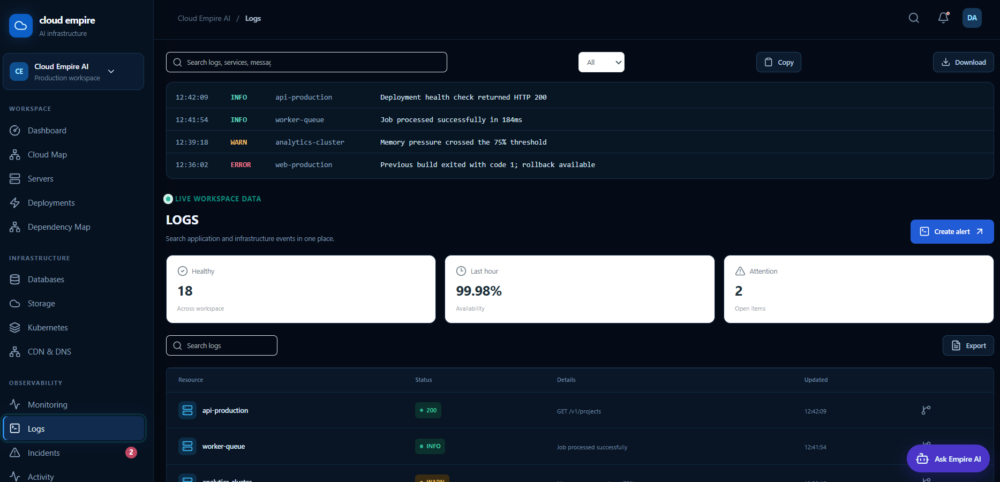</td>
  </tr>
  <tr>
    <td align="center"><b>Monitoring</b><br>CPU, memory, requests, and network against thresholds, with anomaly alerts</td>
    <td align="center"><b>Logs</b><br>Search, filter by level, copy, and download</td>
  </tr>
  <tr>
    <td width="50%">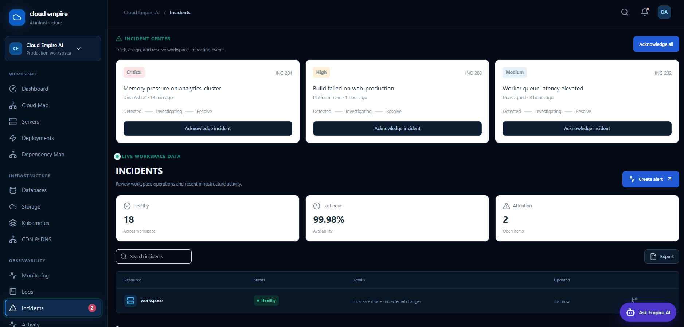</td>
    <td width="50%">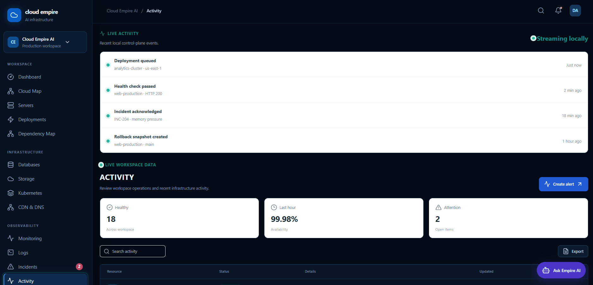</td>
  </tr>
  <tr>
    <td align="center"><b>Incident Center</b><br>Severity levels and a Detected → Investigating → Resolve flow</td>
    <td align="center"><b>Activity</b><br>Streaming timeline of control-plane events</td>
  </tr>
  <tr>
    <td width="50%">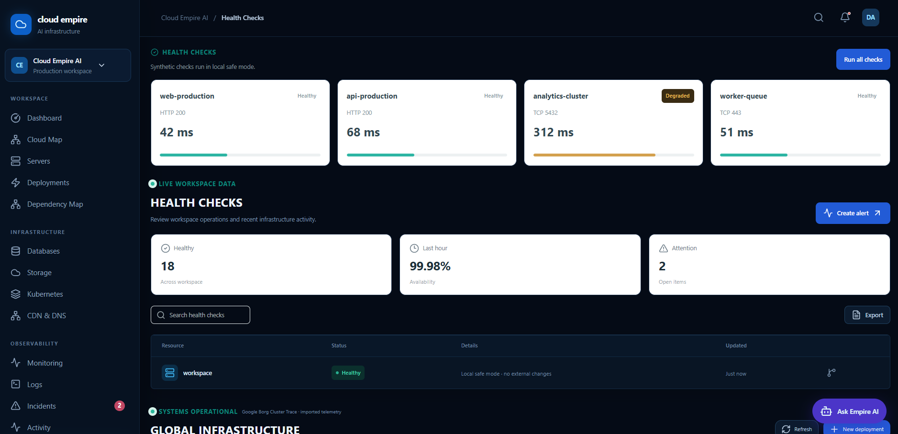</td>
    <td width="50%">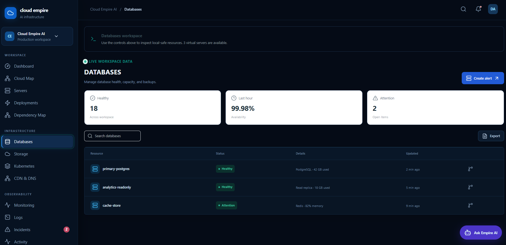</td>
  </tr>
  <tr>
    <td align="center"><b>Health Checks</b><br>Synthetic HTTP and TCP checks with latency</td>
    <td align="center"><b>Databases</b><br>Health, capacity, and usage per database</td>
  </tr>
</table>

### Workspace

<table>
  <tr>
    <td width="33%">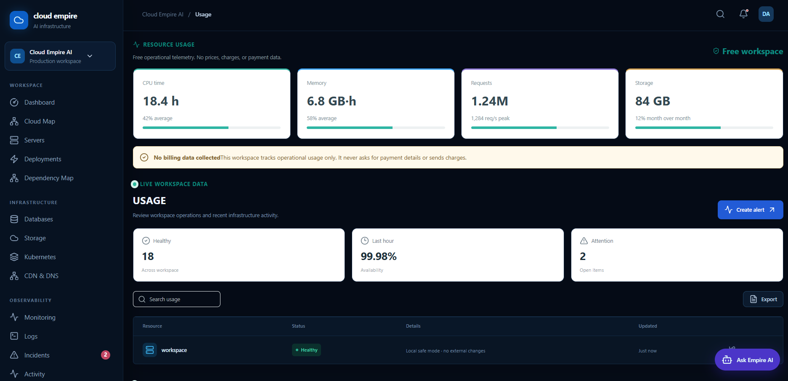</td>
    <td width="33%">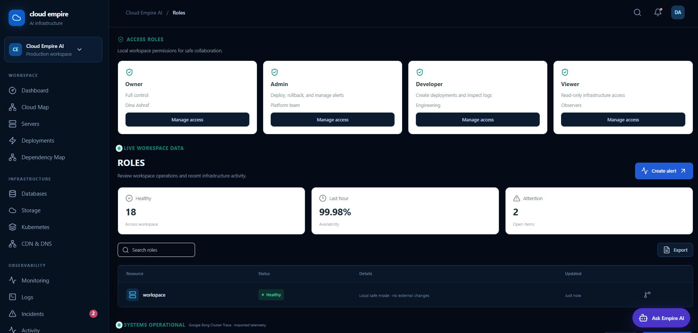</td>
    <td width="33%">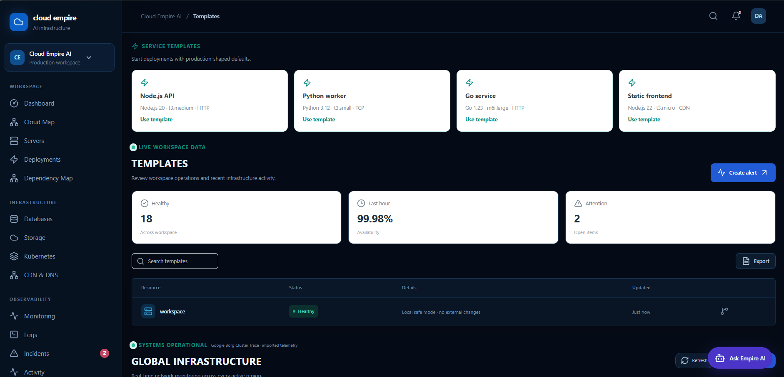</td>
  </tr>
  <tr>
    <td align="center"><b>Free Usage</b><br>Operational telemetry only, with no billing data</td>
    <td align="center"><b>Roles</b><br>Owner, Admin, Developer, Viewer</td>
    <td align="center"><b>Templates</b><br>Production-shaped service defaults</td>
  </tr>
</table>

<details>
<summary><b>More screenshots</b></summary>

<br>

<table>
  <tr>
    <td width="50%">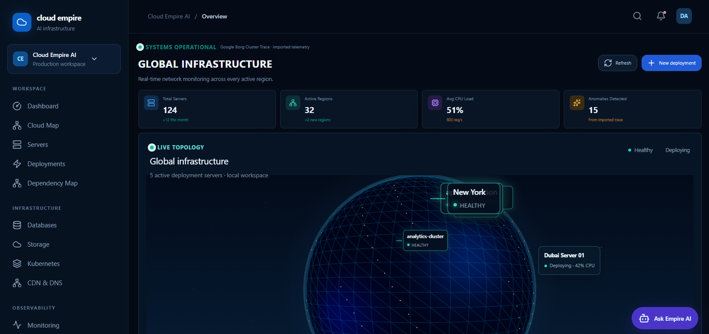</td>
    <td width="50%">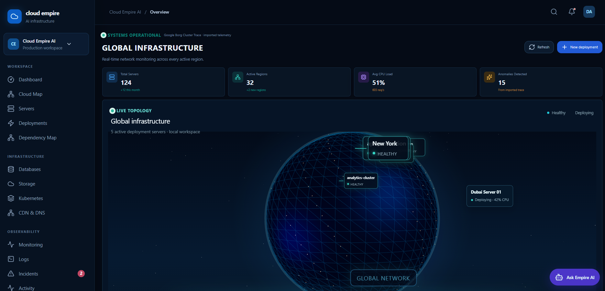</td>
  </tr>
  <tr>
    <td align="center">Global infrastructure, view 1</td>
    <td align="center">Global infrastructure, view 2</td>
  </tr>
  <tr>
    <td width="50%">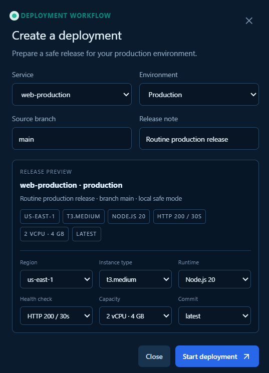</td>
    <td width="50%">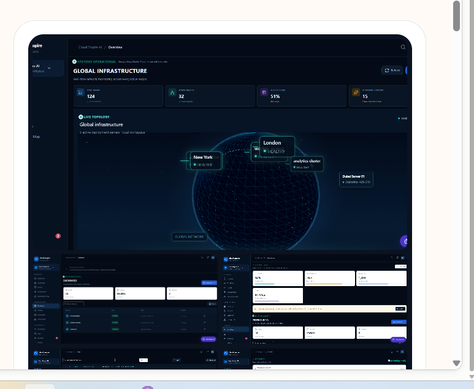</td>
  </tr>
  <tr>
    <td align="center">Create a deployment form</td>
    <td align="center">Product tour</td>
  </tr>
  <tr>
    <td colspan="2">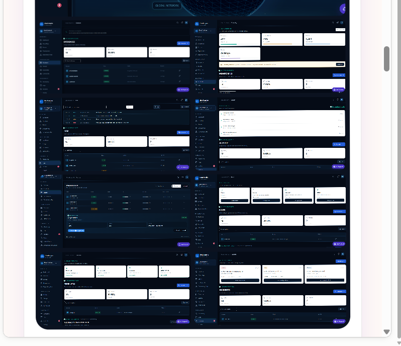</td>
  </tr>
  <tr>
    <td colspan="2" align="center">All main views at a glance</td>
  </tr>
</table>

</details>

## Features

**Control Center**
Central navigation across Dashboard, Cloud Map, Servers, Deployments, Dependency Map, Databases, Storage, Kubernetes, CDN & DNS, Monitoring, Logs, Incidents, Activity, Health Checks, Environment comparison, Backups, Notifications, Webhooks, Usage, Cost estimator, Audit log, Maintenance, Roles, Reports, Templates, Secrets, and Demo scenarios.

**Live 3D Global Topology**
An interactive globe (Three.js / React Three Fiber) showing regions, server health, and deployments in progress, alongside total servers, active regions, average CPU load, and detected anomalies.

**Observability**
Monitoring cards with thresholds, logs, incident states, activity timelines, health checks, anomaly messaging, and 24h / 7d / 30d resource utilization charts built from imported telemetry (Google Borg cluster trace).

**Deployment Workflow**
Guided release creation with a live preview, deployment identifiers, status presentation (Ready, Building, Failed), copy-ID and rollback actions, and safe workflow feedback.

**Ask Empire AI**
A floating AI assistant available on every page of the dashboard, built with the Vercel AI SDK.

**Free Usage**
CPU time, memory, requests, and storage indicators with no prices, payment details, invoices, or charges.

**Backup Center**
Snapshot-oriented interface with daily, weekly, and pre-deployment entries, verification labels, and a snapshot action.

**Authentication**
Email/password sign-in and sign-up using Better Auth, PostgreSQL (Neon), Drizzle, secure cookies, and protected routes.

**Also included:** a health endpoint for operational checks, a reusable server-side authorization helper for role checks, Vercel Analytics, and Privacy Policy and Terms of Service pages.

## How It Works

1. The user opens the Next.js App Router application.
2. Unauthenticated users are directed to the sign-in or sign-up flow.
3. Better Auth handles credentials, password hashing, sessions, and account records.
4. The server uses a shared PostgreSQL pool for Better Auth and Drizzle queries.
5. After authentication, the user reaches the operations dashboard.
6. The dashboard switches between operational views using client-side state and structured datasets.
7. Health and usage surfaces present operational information without collecting payment data.
8. Server-side authorization utilities are available for role checks before protected mutations.

## Tech Stack

| Layer | Technology |
| --- | --- |
| Framework | Next.js 16 (App Router), React 19, TypeScript 5.7 |
| Styling | Tailwind CSS v4 (`@tailwindcss/postcss`), `tw-animate-css`, project CSS tokens |
| UI components | shadcn/ui (`base-nova` style, neutral base color) on Base UI (`@base-ui/react`), `class-variance-authority`, `clsx`, `tailwind-merge` |
| Icons | Lucide React |
| 3D | Three.js, React Three Fiber, Drei |
| AI | Vercel AI SDK (`ai`, `@ai-sdk/react`) |
| Auth | Better Auth (email/password, server-managed sessions) |
| Database | Neon PostgreSQL, `pg`, Drizzle ORM |
| Validation | Zod |
| Analytics | Vercel Analytics |
| Testing | Vitest, TypeScript strict checks, browser verification |
| Package manager | pnpm |

## Project Structure

Key locations (`@/*` maps to the project root):

```text
.
├── app/
│   ├── layout.tsx, page.tsx, globals.css
│   ├── sign-in/, sign-up/        # Authentication pages
│   ├── privacy/, terms/          # Legal pages
│   └── api/
│       ├── ai/                   # Ask Empire AI endpoint
│       ├── auth/[...all]/        # Better Auth handler
│       ├── health/               # Health endpoint (+ Vitest test)
│       └── servers/              # Servers API and actions
├── components/
│   ├── cloud-dashboard.tsx       # Main dashboard shell
│   ├── control-center.tsx        # Navigation and control center
│   ├── operational-view.tsx      # Monitoring, logs, incidents, usage, etc.
│   ├── infrastructure-globe.tsx  # 3D global topology
│   ├── auth-form.tsx             # Sign-in / sign-up form
│   └── ui/                       # shadcn/ui primitives
├── lib/
│   ├── auth.ts, auth-client.ts   # Better Auth server and client
│   ├── authorization.ts          # Server-side role checks
│   ├── utils.ts
│   ├── data/                     # Server and telemetry datasets
│   └── db/                       # Drizzle setup (index.ts, schema.ts)
├── public/                       # Icons and images
├── docs/screenshots/             # README images
├── components.json               # shadcn/ui configuration
├── next.config.mjs               # Next.js config and security headers
├── postcss.config.mjs            # Tailwind CSS v4 PostCSS plugin
├── pnpm-workspace.yaml           # pnpm settings
├── tsconfig.json                 # TypeScript config (strict mode)
├── AGENTS.md / CLAUDE.md         # Instructions for AI coding agents
└── package.json
```

## Design System

A focused technical palette shared by the dashboard and the authentication screens:

| Role | Color |
| --- | --- |
| Background | `#050B16` |
| Panels | `#0A1424` |
| Text | `#E8F2FF` |
| Accent | `#66D9FF` |
| Action | `#2F8CFF` |

## Getting Started

### Prerequisites

- Node.js 20 or newer
- [pnpm](https://pnpm.io/)
- A PostgreSQL database (for example, [Neon](https://neon.tech/))

### Installation

```bash
git clone https://github.com/DinaAshraff9/Cloud-Empire-Ai.git
cd Cloud-Empire-Ai
pnpm install
```

### Environment variables

Copy the example file and fill in your own values:

```bash
cp .env.example .env.local
```

On Windows CMD use `copy .env.example .env.local`.

| Variable | Description |
| --- | --- |
| `DATABASE_URL` | PostgreSQL connection string (for example, from Neon). Read before `POSTGRES_URL`. |
| `BETTER_AUTH_SECRET` | Long random secret used by Better Auth. Generate one with `openssl rand -base64 32`. |

> Never commit `.env*` files with real values. Keep production secrets in your hosting provider's environment settings only.

### Run

```bash
pnpm dev
```

Open [http://localhost:3000](http://localhost:3000).

### Scripts

| Command | Description |
| --- | --- |
| `pnpm dev` | Start the development server |
| `pnpm build` | Create a production build |
| `pnpm start` | Run the production build |
| `pnpm test` | Run the Vitest test suite |

## Deployment

The live demo is hosted on [Vercel](https://vercel.com/). To deploy your own copy:

1. Push the repository to GitHub and import it into [Vercel](https://vercel.com/).
2. Add `DATABASE_URL` and `BETTER_AUTH_SECRET` in the project's environment variables.
3. Deploy, then test sign-up, sign-in, dashboard navigation, the health endpoint, and the legal pages.
4. For a real production platform, connect a cloud provider API and replace the demo datasets with authenticated server-side adapters.

## Security

**Application**

- No payment information, prices, invoices, or billing collection are used.
- Better Auth manages credential hashing and sessions; passwords are never displayed.
- Database queries should stay user-scoped whenever they access user data.
- Role checks must run on the server before sensitive actions. Client visibility is not authorization.
- Never place database URLs, auth secrets, or provider credentials in the browser or in documentation.
- The Backup Center is currently a product surface and metadata workflow. Connect durable external backups before relying on it for disaster recovery.

**HTTP security headers** (configured in `next.config.mjs` for every route)

- `X-Content-Type-Options: nosniff`
- `Referrer-Policy: strict-origin-when-cross-origin`
- `Strict-Transport-Security: max-age=63072000`
- `Permissions-Policy` disabling camera, microphone, and geolocation
- `Content-Security-Policy-Report-Only` for monitoring a policy before enforcing it

TypeScript build errors are never ignored (`ignoreBuildErrors: false`).

## Testing and Quality

- TypeScript compilation check
- Next.js production build check
- Vitest automated test command (`pnpm test`)
- Browser verification of sign-in and dashboard rendering
- Responsive visual review of the authentication experience
- Manual verification of navigation, usage, incidents, activity, health checks, and backup surfaces

## Roadmap

- Real AWS, Vercel, or Kubernetes resource adapters
- Durable external backup storage and restore drills
- Webhook or email alert delivery with rate limiting
- Audit-log persistence and export
- End-to-end browser tests in CI
- Formal role matrix: administrator, operator, viewer, and auditor
- Data retention, incident escalation, and on-call integrations
- Enforce the Content Security Policy after the report-only period

## Notes for AI Coding Agents

This project uses a Next.js version with breaking changes compared to older releases. Before writing code, read the relevant guide in `node_modules/next/dist/docs/` and heed deprecation notices. See [`AGENTS.md`](AGENTS.md); `CLAUDE.md` simply imports it. The agent-rules block in `AGENTS.md` is written and re-added by `next dev`, so commit it with your work to keep the tree clean.

## License

Released under the [MIT License](LICENSE).

## Author

**Dina Ashraff** · [@DinaAshraff9](https://github.com/DinaAshraff9) · [LinkedIn](https://www.linkedin.com/in/dina-ashraff-7a923737b)
